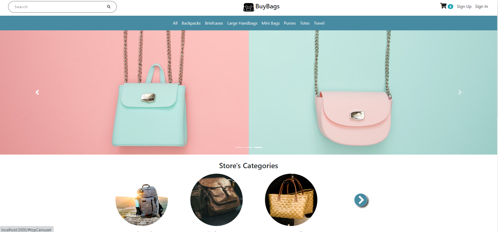

 BuyBags

## Table of contents

- [Introduction](#introduction)
- [Demo](#demo)
- [Run](#run)
- [Technology](#technology)
- [Features](#features)
- [Working on](#Working on)

## Introduction

A virtual ecommerce website using Node js, Express js, and Mongoose.

NOTE: Please read the RUN section before opening an issue.

## Demo

The website resembles a real store and you can add products to your cart and pay for them. If you want to try the checkout process, you can use the dummy card number provided by stripe for testing which is 4242 4242 4242 4242 with any expiration date, CVC, and zip codes. Please <u><b>DO NOT</b></u> provide real card number and data.

In order to access the admin panel on "/admin" you need to provide the admin email and password.

## Run

Fork,Clone and run "npm start" in the terminal and the application should work.

## Technology

The application is built with:

- Node.js version 12.16.3
- MongoDB version 4.2.0
- Express version 4.16.1
- Bootstrap version 4.4.1
- FontAwesome version 5.13.0
- Stripe API v3: used for payment in the checkout page
- Mapbox API: used to show the map in the about us page
- AdminBro: used and customized to implement the admin panel
- Nodemailer: used to send emails from the contact us form
- Passport: used for authentication
- Express Validator: used for form validation

## Features

The application displays a virtual bags store that contains virtual products and contact information.

Users can do the following:

- Create an account, login or logout
- Browse available products added by the admin
- Add products to the shopping cart
- Delete products from the shopping cart
- Display the shopping cart
- To checkout, a user must be logged in
- Checkout information is processed using stripe and the payment is send to the admin
- The profile contains all the orders a user has made

Admins can do the following:

- Login or logout to the admin panel
- View all the information stored in the database. They can view/add/edit/delete orders, users, products and categories. The cart model cannot be modified by an admin because a cart is either modified by the logged in user before the purchase or deleted after the purchase.

## Working on
-To Add ratings and review

### If you like this repo,give a star 😊
 
